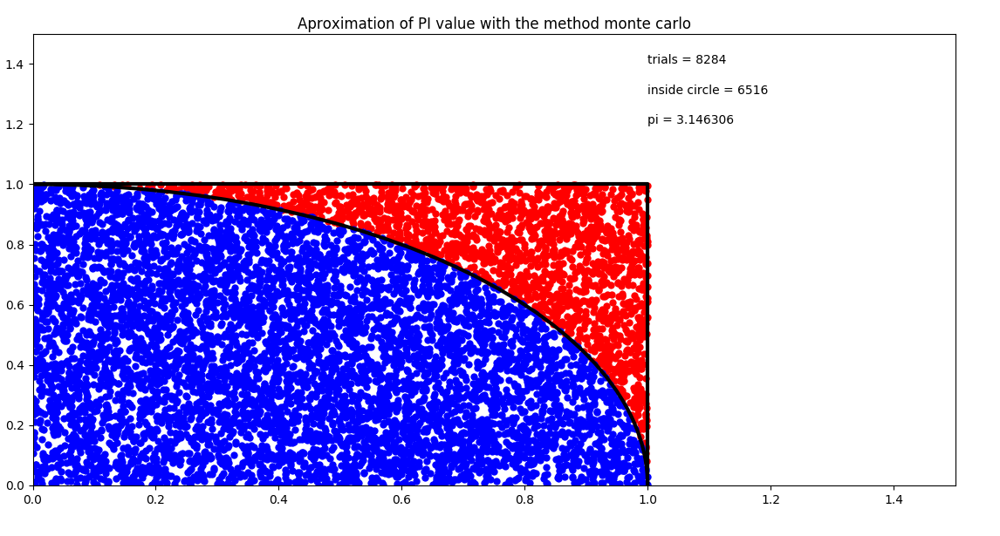

# Approximation PI value with monte carlo method

## Example of calculating the approximation of the PI value with the monte carlo method

The method then consists in drawing at random numbers x and y in the interval [0,1];
if x2 + y2 <1 the point M (x, y) belongs to the quarter disc of radius 1. and is drawn in blue, otherwise it is colored red.
The probability of obtaining a blue dot is equal to the ratio of the areas of the quarter disc of radius 1 and the square of side 1.
It is therefore π / 4.

## Picture off the simulation

